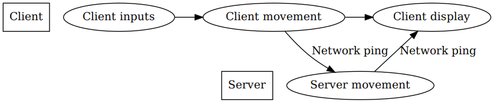

# netcode-demo

A demonstration of an in browser multiplayer game.

To run the demo, first clone the repo, then run ``npm install`` and ``PORT=5000 npm start`` in the repo.

- you can change ``PORT=5000`` to change the port the server binds to.

## netcode architecure:

The client handels movement update for it's player and sends that data to the server, wtich distributes it to other players.

The downside of this model is that the player could cheat by tampering with movement updates. ("you can't trust the player")

The server should do sanity checking on movement data, and handle important properties like items and upgrades, when latency and stutter is not a problem.

